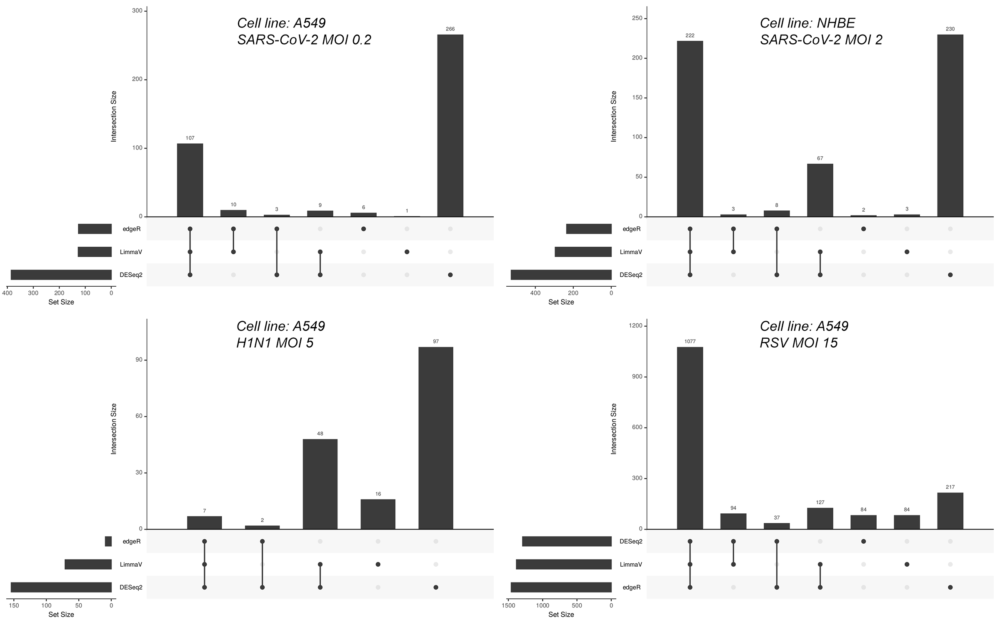
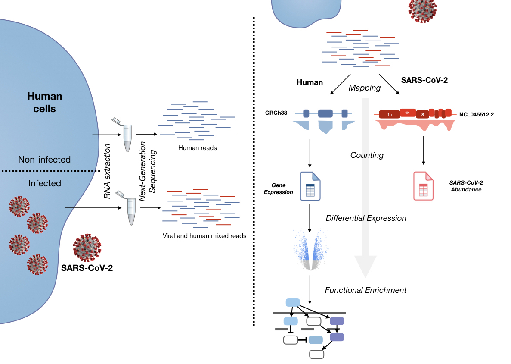
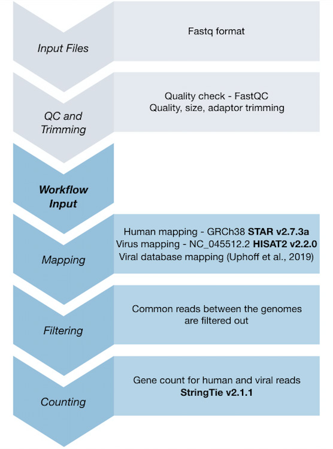

# Introduction

As part of the virtual BioHackathon 2020, we formed a working group that focused on the analysis of gene expression in the context of COVID-19. More specifically, we performed transcriptome analyses on published datasets in order to better understand the interaction between the human host and the SARS-CoV-2 virus.

The ideas proposed during this hackathon were divided into five projects (**Figure 1**):

1. SARS-CoV-2 infection global analyses: Understanding how global gene expression in human cells responds to infection by the SARS-CoV-2 virus, including changes in gene regulatory networks.
2. Human-virus interaction analyses: Identification of human RNA-binding proteins that might be key in the interaction between human cells and the RNA genome of SARS-CoV-2.
3. Increased risk factors analyses: Investigating gene expression in other datasets with the goal of identifying commonalities and differences with the two previous analyses, focusing on specific genes.
4. Identification of potential pharmacological treatments: Searching for potential drugs that could impact the expression of human genes that are important for the interaction of human and virus.
5. Workflows for reproducibility of analysis: Packaging the workflows devised within the Gene Expression group to enable seamless integration and approach reproducibility. 

Projects 1 and 2 aim to identify human genes that are important in the process of viral infection of human cells. Projects 3 and 4 aim to take the candidate genes identified in projects 1 and 2, as well as by independent studies, and relate them to clinical information and to possible therapeutic interventions. All data analyzed during this study are fully available and meet the FAIR principles of **F**indability, **A**ccessibility, **I**nteroperability, and **R**eusability. Finally, Project 5 aims to package and containerize software and workflows used and generated here in a reusable manner, ultimately providing scalable and reproducible workflows.

# Background

Severe acute respiratory syndrome coronavirus 2  (SARS-CoV-2) is a novel betacoronavirus responsible for causing the disease COVID-19. The virus emerged in December of 2019 in Wuhan, China [@Huang2020-fk]. Ever since, the scientific community has gathered to resolve this pandemic through efforts to detect the novel features of this virus and to better understand its pathogenic mechanisms.

The Spike (S) protein of SARS-CoV-2, for instance, has been described to facilitate viral entry into human cells by using the receptor angiotensin-converting enzyme 2 (ACE2) and has been shown to be primed by the cellular serine protease TMPRSS2 [@Hoffmann2020-si]. Single cell RNA sequencing of several human tissues also detected alanyl and glutamyl aminopeptidases (ANPEP and ENPEP) as well as dipeptidyl peptidase-4 (DPP4) as candidate co-receptors for SARS-CoV-2 [@Qi2020-dh]. Even though the mechanisms of replication and host-viral interactions have not been completely elucidated for this particular virus, coronaviruses in general have extremely large genomes when compared to other plus strand  RNA viruses and employ a complex genome expression strategy [@De_Wilde2018-ug]. The need for an effective treatment for COVID-19 is urgent and, as a result, as of April 10th 2020, 159 peer-reviewed papers on PubMed are related to drug discovery or repositioning for this infection. Several studies aim to detect proteins that interact directly with the SARS-CoV-2 viral proteins (e.g., [@Gordon2020-hk], in order to find druggable targets. 

However, viruses also trigger a specific but rather drastic transcriptomic response to their infection. Such changes in gene regulation may be associated with viral success and can be seen as potential drug targets as well. A recent preprint [@Blanco-Melo2020-ep] studied the transcriptomic response of human cells to SARS-CoV-2, Influenza virus A (IAV/H1N1) and respiratory syncytial virus (RSV), concluding that each virus elicits core antiviral responses and that the only differentially expressed (DE) genes exclusive to SARS-CoV-2 infection were secreted peptides implicated in respiratory diseases.

While SARS-CoV-2 triggers a transcriptional response in the human genome, it has been shown that coronavirus genomes are themselves bound and regulated by many human RNA-binding proteins [@Shi2005-ob], which play essential roles in regulating viral transcription, replication and translation.  For instance, eukaryotic elongation factor 1-alpha (eEF1A) has been described to interact with RNA-dependent RNA polymerase (RdRp) from turnip mosaic virus and in turn stimulates the recruitment of the RNA template to cellular membranes [@Thivierge2008-pr]. Conversely, Nucleolin (Nsr1p) binds to the 3' noncoding region of the tombusvirus RNA and is able to inhibit viral replication [@Jiang2010-aw].

In this work, we analyzed not only the aforementioned transcriptomic dataset, but also two additional studies involving SARS and MERS, with GEO accessions GSE122876 [@Yuan2019-pw] and GSE56192. All datasets used were mapped to the GRCh38 assembly of the human genome (see Methods for details), as well as to a database of viral sequences [@Uphoff2019-me]. The overarching goal was to find specific features from SARS-CoV-2 which are less accentuated or absent in the other species.

Since it is not yet known which specific human proteins bind to the SARS-CoV-2 genome or what role they play, we also analyzed the SARS-CoV-2 genome sequence to predict putative interactions with human RNA-binding proteins, and used the gene expression analysis we performed to identify instances of bidirectional regulation between human RNA-binding proteins and SARS-CoV-2. Finally, we used two complementary approaches, as a proof of concept, to propose potential drugs for the treatment of COVID-19.

Therefore, the objective of this working group was to carry out a comprehensive analysis of publicly available data, involving multidisciplinary approaches, and to provide workflows that allow scientific reproducibility, overall abiding by the FAIR principles. Even though functional studies should be carried out in order to validate our analyses and predictions, we believe we provide here novel insights on the virulence of SARS-CoV-2 that will be helpful to fight COVID-19 in the future. 

# Results

## Global analyses of SARS-CoV-2 infection reveal a unique transcriptional response

### Gene expression analysis of host response during SARS-CoV-2 infection (Pipeline 1)

*Exploratory data analysis*

We used the first RNA-Seq dataset available of in vitro cells infected with SARS-CoV-2 (GSE147507), as mentioned in the previous section. We first performed a Principal Component Analysis (PCA) to bring out strong patterns in the data to analyze the overall effect of experimental covariates, and to identify unexpected outliers or batch effects. **Figure 2** shows that there exist clear sources of variation in the data that need to be taken into account if cross-sample analyses were to be performed.

![PCA analysis of samples used in this report. The first 2 components (~85% of total variance) showed different sources of variation in the data. Replicate samples from the same group cluster correctly together. The image on the left shows that different cell lines, i.e. A549 and NHBE, present strongly different expression profiles; the image on the right shows samples from the same batch cluster together. PC = principal component, vst = variance stabilizing transformation [@Anders2010-cy]. \label{fig}](./figures/Fig2.png)

Since our aim was to find specific SARS-CoV-2-infection regulated genes, we decided to perform the downstream analyses on pairwise comparisons controls vs. infected within each experiment (batch), maintaining the different cell lines separated, and comparing the results of the differential expression and functional analyses across experiments.

*Differentially expressed genes*

We decided to focus on genes differentially expressed (DE) upon SARS-CoV-2 infection, whether detected in NHBE or in A549 cells. **Figure 3** shows the number of genes DE detected from each of the methods used: DESeq2 [@Love2014-jg], edgeR [@Robinson2010-lh] and limma-voom [@Law2014-jg]; for details, see the Methods section. In order to select SARS-CoV-2 specific genes, we selected among these DE genes only those that were not present in the other RSV and H1N1 infected cells. The full list has been made publicly available through the Zenodo platform (see the “Data, GitHub repositories and reproducible workflows” section). The top 15 genes up- and down-regulated are given in **Table 1** and **Table 2**.

**Table 1**. Top 15 upregulated genes which were common to the three methods (only the log2FC and FDR-adjusted p-values from edgeR are indicated below).

|  GeneSymbol  |  log2FC  |  padj  |
| ---- | ---- | ---- |
|  S100A7  |  8.342  |  0.002  |
|  SPRR2E  |  3.57  |  0  |
|  CSF2  |  2.886  |  0.002  |
|  SPRR2D  |  3.016  |  0  |
|  IL36G  |  2.719  |  0  |
|  VNN3  |  2.722  |  0.006  |
|  MMP9  |  2.327  |  0.001  |
|  VNN1  |  2.076  |  0.002  |
|  TNF  |  1.931  |  0.004  |
|  MRGPRX3  |  2.081  |  0.01  |
|  S100A8  |  1.879  |  0  |
|  KRT24  |  1.863  |  0.006  |
|  TNFSF14  |  1.795  |  0.008  |
|  SPRR2A  |  1.705  |  0  |
|  PGLYRP4  |  1.721  |  0  |

**Table 2**. Top 15 downregulated genes which were common to the three methods (only the log2FC and FDR-adjusted p-values from edgeR are indicated below).

|  GeneSymbol  |  log2FC  |  padj  |
| ---- | ---- | ---- |
|  CACNB4  |  -8.005  |  0.01  |
|  PRODH  |  -1.509  |  0.072  |
|  NANOS1  |  -1.546  |  0.035  |
|  NID1  |  -1.276  |  0.013  |
|  ZNF488  |  -1.101  |  0.035  |
|  CD86  |  -1.104  |  0.029  |
|  IL16  |  -1.051  |  0.039  |
|  VTCN1  |  -1.017  |  0.014  |
|  PPARGC1A  |  -1.092  |  0.01  |
|  METTL7A  |  -1.006  |  0.005  |
|  LRMP  |  -0.926  |  0.043  |
|  THBD  |  -0.976  |  0.005  |
|  OLFML2A  |  -0.961  |  0.002  |
|  MXRA5  |  -0.902  |  0.003  |
|  KRT15  |  -0.914  |  0.003 |
 

*Functional enrichment analyses*

Subsequently, we used GeneAnalytics [@Ben-Ari_Fuchs2016-sh] on the previous list of DE genes to detect enriched pathways and gene ontology terms. The complete results are available online following the FAIR principles (see “Data, GitHub repositories and reproducible workflows”). In general, SARS-CoV-2 datasets were enriched in pathways related to immune response, viral response, bacterial infection, receptor signalling pathways, among others, similar to the other two viral species tested. However, we could detect some interesting pathways enriched only in SARS-CoV-2 infections, namely lung fibrosis, chemokine superfamily pathway, IL-17 family signalling pathways and legionellosis (which is a severe type of bacterial pneumonia).

### Viral gene expression of SARS-CoV-2

We estimated SARS-CoV-2 gene expression in samples infected with the virus. To this end, we used reads mapping to the SARS-CoV-2 Wuhan-Hu-1 reference genome (NC_045512.2), which ranged from 0.10% in NHBE cell lines to 0.03% in A549 of total reads. Our pipeline inferred the abundances of five different viral transcripts, one of them on the negative strand (**Table 3**). We performed hierarchical clustering based on these values as a proxy for viral gene expression. With the exception of one of the NHBE samples, A549 and NHBE samples clustered together, suggesting that viral expression was similar in both cell types (**Figure 4**).

**Table 3**. Viral gene expression of SARS-CoV-2 infected samples in FPKM (Fragments Per Kilobase of transcript per Million mapped reads). 

|  | MSTRG.1 | MSTRG.2 | MSTRG.3 | MSTRG.4 | MSTRG.5 |
|---------|---------|---------|---------|---------|---------|
| SRX7990877 | 1056.94 | 0 | 168254.63 | 40704.32 | 1107923.84 |
| SRX7990876 | 1356.43 | 0 | 211354.75 | 33298.12 | 1059082.82 |
| SRX7990875 | 1473.57 | 0 | 233342.98 | 50809.79 | 1201995.40 |
| SRX7990871 | 992.38 | 0 | 162571.34 | 18084.87 | 588801.78 |
| SRX7990870 | 989.68 | 0 | 159455.20 | 18338.65 | 1171678.71 |
| SRX7990869 | 1290.11 | 2209.47 | 166766.50 | 21733.26 | 1095029.75 |

### Comparative analysis of host response to SARS-CoV-2, SARS-CoV-1, RSV, IAV, and MERS-CoV infections (Pipeline 2)

*Gene expression analysis*

These analyses included two other datasets that were not integrated in the previous pipeline, and that are further detailed in the datasets from the Methods section. Statistical analyses of the differential gene expression, transcript isoforms, functional terms, and signaling pathways yielded a large number of significant entities, even after applying multiple hypothesis correction (FDR-adjusted p-values or Bonferroni-adjusted p-values as detailed in **Table 4**, **Table 5**, **Table 6**, and **Table 7**).

**Table 4**. Numbers of significant FDR-adjusted p-values DE genes across multiple virus studies.

|  Public Identifier  |  Virus Taxon  |  Comparison  |  #  |
| ----  | ----  | ----  | ---- |
|  GSE122876  |  MERS-CoV  |  Infected vs mock  |  9,498  |
|  GSE56192  |  MERS-CoV  |  MERS, high MOI, 24 hpi vs mock  |  8,615  |
|  GSE56192  |  MERS-CoV  |  MERS, high MOI, 48 hpi vs mock  |  13,006  |
|  GSE56192  |  MERS-CoV  |  MERS, low MOI, 24 hpi vs mock  |  1,358  |
|  GSE56192  |  MERS-CoV  |  MERS, low MOI, 48 hpi vs mock  |  12,856  |
|  GSE56192  |  SARS-CoV-1  |  SARS, high MOI, 24 hpi vs mock  |  5,372  |
|  GSE56192  |  SARS-CoV-1  |  SARS, high MOI, 48 hpi vs mock  |  2,130  |
|  GSE56192  |  SARS-CoV-1  |  SARS, low MOI, 24 hpi vs mock  |  5,557  |
|  GSE56192  |  SARS-CoV-1  |  SARS, low MOI, 48 hpi vs mock  |  5,477  |
|  GSE147507  |  Influenza A  |  Infected vs mock  |  4,205  |
|  GSE147507  |  RSV  |  Infected vs mock  |  3,661  |
|  GSE147507  |  SARS-CoV-2 (NHBE)  |  Infected vs mock  |  1,832  |
|  GSE147507  |  SARS-CoV-2 (A549)  |  Infected vs mock  |  427  |

**Table 5**. Significant FDR-adjusted p-values transcript isoforms detected during infection with multiple viruses.

|  Public Identifier  |  Virus Taxon  |  Comparison  |  #  |
| ----  | ----  | ----  | ---- |
|  GSE122876  |  MERS-CoV  |  Infected vs mock  |  1,363  |
|  GSE56192  |  MERS-CoV  |  MERS, high MOI, 24 hpi vs mock  |  418  |
|  GSE56192  |  MERS-CoV  |  MERS, high MOI, 48 hpi vs mock  |  2,500  |
|  GSE56192  |  MERS-CoV  |  MERS, low MOI, 24 hpi vs mock  |  3  |
|  GSE56192  |  MERS-CoV  |  MERS, low MOI, 48 hpi vs mock  |  2,077  |
|  GSE56192  |  SARS-CoV-1  |  SARS, high MOI, 24 hpi vs mock  |  224  |
|  GSE56192  |  SARS-CoV-1  |  SARS, high MOI, 48 hpi vs mock  |  94  |
|  GSE56192  |  SARS-CoV-1  |  SARS, low MOI, 24 hpi vs mock  |  221  |
|  GSE56192  |  SARS-CoV-1  |  SARS, low MOI, 48 hpi vs mock  |  175  |
|  GSE147507  |  Influenza A  |  Infected vs mock  |  216  |
|  GSE147507  |  RSV  |  Infected vs mock  |  11  |
|  GSE147507  |  SARS-CoV-2 (NHBE)  |  Infected vs mock  |  4  |
|  GSE147507  |  SARS-CoV-2 (A549)  |  Infected vs mock  |  N.S.  |

**Table 6**. Statistically significant FDR-adjusted p-values functional enrichment results across multiple virus taxa.

|  Public Identifier  |  Virus Taxon  |  Comparison  |  #  |
| ----  | ----  | ----  | ---- |
|  GSE122876  |  MERS-CoV  |  Infected vs mock  |  N.S.  |
|  GSE56192  |  MERS-CoV  |  MERS, high MOI, 24 hpi vs mock  |  20  |
|  GSE56192  |  MERS-CoV  |  MERS, high MOI, 48 hpi vs mock  |  2  |
|  GSE56192  |  MERS-CoV  |  MERS, low MOI, 24 hpi vs mock  |  23  |
|  GSE56192  |  MERS-CoV  |  MERS, low MOI, 48 hpi vs mock  |  12  |
|  GSE56192  |  SARS-CoV-1  |  SARS, high MOI, 24 hpi vs mock  |  N.S.  |
|  GSE56192  |  SARS-CoV-1  |  SARS, high MOI, 48 hpi vs mock  |  1  |
|  GSE56192  |  SARS-CoV-1  |  SARS, low MOI, 24 hpi vs mock  |  1  |
|  GSE56192  |  SARS-CoV-1  |  SARS, low MOI, 48 hpi vs mock  |  N.S.  |
|  GSE147507  |  Influenza A  |  Infected vs mock  |  5  |
|  GSE147507  |  RSV  |  Infected vs mock  |  299  |
|  GSE147507  |  SARS-CoV-2 (NHBE)  |  Infected vs mock  |  356  |
|  GSE147507  |  SARS-CoV-2 (A549)  |  Infected vs mock  |  114  |

**Table 7**. Statistically significant Bonferroni-adjusted p-values signaling pathway enrichment results from cells infected with multiple virus taxa.

|  Public Identifier  |  Virus Taxon  |  Comparison  |  #  |
| ----  | ----  | ----  | ---- |
|  GSE122876  |  MERS-CoV  |  Infected vs mock  |  46  |
|  GSE56192  |  MERS-CoV  |  MERS, high MOI, 24 hpi vs mock  |  75  |
|  GSE56192  |  MERS-CoV  |  MERS, high MOI, 48 hpi vs mock  |  90  |
|  GSE56192  |  MERS-CoV  |  MERS, low MOI, 24 hpi vs mock  |  20  |
|  GSE56192  |  MERS-CoV  |  MERS, low MOI, 48 hpi vs mock  |  113  |
|  GSE56192  |  SARS-CoV-1  |  SARS, high MOI, 24 hpi vs mock  |  74  |
|  GSE56192  |  SARS-CoV-1  |  SARS, high MOI, 48 hpi vs mock  |  89  |
|  GSE56192  |  SARS-CoV-1  |  SARS, low MOI, 24 hpi vs mock  |  118  |
|  GSE56192  |  SARS-CoV-1  |  SARS, low MOI, 48 hpi vs mock  |  37  |
|  GSE147507  |  Influenza A  |  Infected vs mock  |  20  |
|  GSE147507  |  RSV  |  Infected vs mock  |  10  |
|  GSE147507  |  SARS-CoV-2 (NHBE)  |  Infected vs mock  |  4  |
|  GSE147507  |  SARS-CoV-2 (A549)  |  Infected vs mock  |  9  |

*Integrative analysis*

Combining the results from the multiple pathway and functional enrichment analyses revealed 56 activated pathways and 185 inhibited pathways across the combined dataset. Of these, nine pathways were activated during SARS-CoV-2 infection, while four were inhibited. Six pathways were uniquely present during SARS-CoV-2 infection (e.g. “Complement and Coagulation Cascades”, “TRAF6 mediated induction of NF-kB and MAP kinase”, and “Cytokine Signaling in Immune system”). We also found two pathways that had opposite directionality during SARS-CoV-2 infection when compared to other viruses (Chemokine signaling, Plasminogen activating cascade). 

A similar analysis that focused on the enriched functional terms showed 279 annotated terms that were unique to SARS-CoV-2 infection (e.g. CXCR_chemokine_receptor_binding, arachidonic_acid_binding, Interleukin_1_receptor_binding), while two terms were observed to have opposite directionality (Fibrinogen_complex, Protein_activation_cascade).
 
In both pathway and functional analyses, it became apparent that the response to SARS-CoV-2 infection between the human A549 and NHBE cells was extremely different. This result could be caused by one or more biological phenomena such as the quantity of virus used in the infection for each of the cells (A549 with MOI 0.2 and NHBE with MOI 2) or differences in cell biology (NHBE are primary cells, whereas A549 are immortalized lung adenocarcinoma cells); moreover, differences in protocols or other batch effects could also have contributed to this observation.

### Gene regulatory networks

In order to understand and detect key regulators playing a role during infection, we applied two different approaches: the first aimed at finding genes promoted by transposable elements (TEs), whereas the second focused on inferring regulatory motifs by modeling transcript isoform expression changes as a function of motif activity and the regulatory binding sites located within the promoter regions and the 3' UTRs of transcripts, respectively.

*TE analysis*

TEs are DNA sequences that are able to move throughout the genome. The human genome is composed of nearly 50% of TEs [@Lander2001-aa], and while most of them are no longer able to transpose, LINE-1 and Alu elements are still active [@Brouha2003-fr; @Deininger2002-rw]. Cross-talk between exogenous viruses and TEs, especially endogenous retroviruses, through common regulatory pathways has been described in many model species [@Broecker2019-ke; @Ito2013-jj; @Miesen2016-kj]. A recent study has shown that upon viral infection, early TE upregulation is observed, independently of the virus type [@Macchietto2020-xs]. The authors suggest such upregulation might elicit the immune system at an early stage of infection. Hence, in order to fully understand the impact of SARS-CoV-2 infection of human cells, we searched for differences in TE expression using two different available tools, TEtools [@Lerat2017-dg], and TEtranscripts [@Jin2015-za]. We are currently computing the TE expression differences between controls and infected cells from [@Blanco-Melo2020-ep]. 

*Analysis of regulation of gene expression*

Activities of regulators that can explain genome-wide expression changes observed upon viral infection were inferred by modelling them as a function of regulator binding sites in promoter regions and 3' UTRs, respectively, and the (unknown) activities of the regulators [@Balwierz2014-og].

In both NHBE and A549 cells, among the motifs that are most significantly changing in activity upon infection with the SARS-CoV-2 virus are the interferon-regulatory factors (IRFs), which play critical roles in the cellular immune response to virus infection [@Chiang2018-zr; @Zhao2015-as]. The IRF motif activities are significantly higher compared to uninfected cells reflecting that the virus causes genome-scale upregulation of IFN-stimulated genes (ISGs). Similarly to IRFs, also the RELA transcriptional regulator exhibits significantly increased activity upon SARS-CoV-2 infection in both cell lines. Importantly, RELA is known to be crucial for inhibiting the replication of RNA viruses [@Wang2010-ow]. 

## SARS-CoV-2 RNA contains binding sites for human proteins

We searched the SARS-CoV-2 viral genome to identify binding sites for human RNA-binding proteins. Scanning the genome sequence of SARS-CoV-2 with Position Weight Matrices (PWMs) for human RNA-binding proteins (RBPs) revealed potential binding sites for 99 proteins. We tested for statistical enrichment of binding sites for individual proteins and discovered that binding sites for 19 proteins were significantly enriched in the SARS-CoV-2 genome (FDR-adjusted p-value < 0.01; see **Table 8**).

**Table 8**. 19 proteins whose binding sites are enriched in the SARS-CoV-2 genome

|Number|Name|Num_sites   |P_adj         |
|------|---------|----|--------|
|1     |HNRNPL   |632 |2.7e-32 |
|2     |FUS      |140 |5.4e-24 |
|3     |MBNL1    |682 |2.0e-19 |
|4     |SRSF1    |335 |1.5e-13 |
|5     |RBMY1A1  |107 |1.3e-11 |
|6     |ZFP36    |609 |8.3e-11 |
|7     |SRSF10   |88  |8.7e-10 |
|8     |PTBP1    |3151|1.5e-08 |
|9     |SRSF3    |74  |3.1e-07 |
|10    |YBX2     |51  |3.5e-07 |
|11    |PABPC1   |118 |1.9e-06 |
|12    |PABPN1   |50  |1.3e-05 |
|13    |SART3    |49  |3.6e-05 |
|14    |PABPC4   |28  |3.1e-04 |
|15    |ZNF638   |27  |3.1e-04 |
|16    |PABPC5   |33  |7.4e-04 |
|17    |CELF2    |698 |1.6e-03 |
|18    |PABPC3   |34  |1.8e-03 |
|19    |YBX1     |204 |3.3e-03 |

We also performed enrichment analyses separately for the SARS-CoV-2 5’ and 3’ UTR sequences and identified 4 human RBPs whose binding sites were enriched on the 5’UTR and 11 whose binding sites were enriched in the 3’UTR (see **Table 9**). 

**Table 9**. 15 proteins whose binding sites are enriched in the SARS-CoV-2 UTRs

|Number|Name     |Num_sites  |P_adj   | Region |
|------|---------|-----------|--------|--------|
|1     |PABPC4   |27         |1.4e-127|3'UTR   |
|2     |SART3    |28         |7.9e-107|3'UTR   |
|3     |PABPC1   |28         |2.0e-76 |3'UTR   |
|4     |SRSF10   |27         |3.1e-76 |3'UTR   |
|5     |KHDRBS3  |28         |1.4e-46 |3'UTR   |
|6     |LIN28A   |3          |3.3e-09 |3'UTR   |
|7     |HNRNPA2B1|2          |2.4e-08 |3'UTR   |
|8     |HNRNPA1L2|2          |2.8e-07 |3'UTR   |
|9     |PPIE     |42         |8.3e-07 |3'UTR   |
|10    |HNRNPA1  |4          |3.1e-04 |3'UTR   |
|11    |NONO     |2          |3.3e-03 |3'UTR   |
|12    |FMR1     |2          |3.1e-10 |5'UTR   |
|13    |RBM24    |2          |2.1e-05 |5'UTR   | 
|14    |CELF5    |1          |7.1e-04 |5'UTR   |
|15    |ZRANB2   |4          |5.1e-03 |5'UTR   |

Although SARS-CoV-2 has a single-stranded positive-sense genome, negative-sense intermediate RNAs are produced as part of the infection process. We therefore identified binding sites on the negative-strand RNA sequence as well. The negative strand of the SARS-CoV-2 genome was found to be enriched in binding sites for 15 human proteins (see **Table 10**).

**Table 10**. proteins whose binding sites are enriched in the SARS-CoV-2 negative strand genome sequence

|Number|Name     |Num_sites |P_adj  |
|------|---------|----------|-------|
|1     |NOVA2    |95        |1.1e-32|
|2     |YBX1     |361       |2.7e-29|
|3     |HNRNPL   |769       |6.0e-28|
|4     |NOVA1    |918       |6.0e-28|
|5     |YBX2     |92        |8.2e-23|
|6     |CELF2    |619       |8.0e-12|
|7     |SRSF3    |88        |3.1e-09|
|8     |CELF6    |30        |1.8e-06|
|9     |TIA1     |998       |1.8e-04|
|10    |ELAVL1   |104       |2.2e-04|
|11    |FUS      |72        |5.0e-04|
|12    |CELF4    |20        |5.5e-04|
|13    |ZFP36    |505       |5.1e-03|
|14    |HNRNPDL  |209       |5.4e-03|
|15    |RBFOX1   |51        |7.7e-03|

We analyzed the list of putative SARS-CoV-2 interacting proteins with GeneAnalytics. The list of RBPs was found to be enriched for proteins involved in mRNA splicing, translational control, gene expression, deadenylation-dependent mRNA decay and formation of the HIV-1 elongation complex containing HIV-1 TAT (HNRNPA1, PABPN1, SRSF3, SRSF1, PTBP1).

We next searched the DE gene sets generated by our previous analyses, as well as a protein expression dataset [@Bojkova2020-bd] to test whether any of the putative virus-interacting proteins showed expression changes in response to viral infection. We saw evidence of weak (FC<1.5) but significant (adjusted p-value < 0.05) increase in protein expression 24 hours after infection for ELAVL1, PABPC1, PTBP1, and SRSF1. For ELAVL1, this was supported by a similar change in gene expression levels in infected NHBE cells. Interestingly, the PABPC1 and PABPC4 proteins, whose binding sites are enriched in the SARS-CoV-2 3’UTR, have been shown to interact with the N protein of SARS-CoV-2 [@Gordon2020-hk] suggesting that they participate in the cellular response to infection by means of both protein-RNA and protein-protein interactions, perhaps by forming a combined RNA-binding complex with viral proteins.

Finally, to identify differences in host cell interactions between SARS-CoV-2 and related coronaviruses, we repeated this analysis for the genomes of SARS-CoV-1 as well as the RaTG13 bat coronavirus that shares high sequence similarity with SARS-CoV-2 [@Zhou2020-xy]. We found several differences between the predicted interaction partners of SARS-CoV-2 and the other two coronaviruses. In particular, binding sites for PABPC1, PABPC3, PABPC5, ZNF638, CELF2 and YBX1 were enriched in the SARS-CoV-2 genome but not in the genome of SARS-CoV-1. Binding sites of SRSF3, TIA1, ELAVL1 and FUS were enriched in the SARS-CoV-2 3’UTR but not in the SARS-CoV-1 3’UTR, while binding sites for ELAVL1, HNRNPDL and RBFOX1 were enriched in the 3’UTR of SARS-CoV-2 but not RaTG13.

## Risk factors analyses

### Integrated analysis with chronic obstructive pulmonary disorder

We combined the virus results reported in Project 1, with those generated from an analysis of a subset of samples (20 cases vs. 20 controls) from human patients diagnosed with chronic obstructive pulmonary disorder (COPD; GSE57148). Briefly, the significant results consisted of: 1,724 DEGs, 66 isoforms, 16 pathways, and 0 functional terms. Comparing these results to those identified in the host response to virus infection revealed several shared pathways (e.g. Innate immune system, Nonsense-mediated decay). Even so, none of the significant COPD pathways were identical to those for SARS-CoV-2. Interestingly, there were a subset of pathways that were unique to COPD when compared against virus infection (e.g. PI3 kinase pathway, IL1-mediated signaling events, IL23-mediated signaling events). Additional experimental work in the wet lab is required to identify the underlying mechanism(s) of why these patients are at high risk for complications from infection with SARS-CoV-2.

### Analysis of HLA types that predispose individuals and populations to COVID-19 

A recent preprint [@Nguyen2020-yl] describes an in silico analysis of viral peptide-MHC class I binding affinity across all known HLA -A, -B, and -C genotypes for all SARS-CoV-2 peptides. The SARS-CoV-2 proteome is successfully sampled and presented by a diversity of HLA alleles. In particular, HLA-B\*46:01 had the fewest predicted binding peptides for SARS-CoV-2, and has already been shown to correlate with SARS severity in Asian populations [@Lin2003-tv]. Conversely, HLA-B\*15:03 showed the greatest capacity to present highly conserved SARS-CoV-2 peptides. Three of the worst-presenting HLA-A, -B, and -C alleles are A\*25:01, B\*46:01, C\*01:02, while three of the best-ones are A\*02:02, B\*15:03, and C\*12:03.  Results are summarized in **Table 11**.

**Table 11**. Result of HLA typing

| Dataset   | Cell line | HLA-A1 | HLA-A2 | HLA-B1 | HLA-B2 | HLA-C1 | HLA-C2 |
|-----------|-----------|---------|---------|---------|---------|---------|---------|
| GSE147507 | NHBE      | A\*24:02 | A\*34:02 | B\*08:01 | B\*15:07 | C\*03:03 | C\*07:01 |
| GSE147507 | A549      | A\*25:01 | A\*30:01 | B\*18:01 | B\*44:03 | C\*16:01 | C\*12:03 |
| GSE122876 | Calu-3    | A\*68:01 | A\*24:02 | B\*51:01 | B\*07:02 | C\*15:02 | C\*07:02 |
| GSE56192  | MRC-5     | A\*29:02 | A\*02:01 | B\*07:02 | B\*44:02 | C\*07:02 | C\*05:01 |

Analyzing the expression levels of the HLA class I genes, we did not find signatures specific to SARS-CoV-2. However, the A549 line presents, in heterozygosity, the predicted worst HLA-A allele, and the predicted best HLA-C allele. Interestingly, the expression level of the HLA-C allele is lower than the expression level of the HLA-A gene, which could  potentially mean that these cells might not have SARS-CoV-2 strong epitope binders.

Additional data is required to further analyze how the HLA class I genes expression level and the specific genotypes could predispose individuals and populations to SARS-CoV-2 infections and mortality.

## Potential candidates for pharmacological intervention

As a first approach to determine which compounds could be relevant in relation to COVID-19, we used the list of DE genes obtained in Project 1 as input to the gene-compound association analysis within GeneAnalytics (see Methods). A number of compounds were identified as significant, including the corticosteroid dexamethasone (padj = 1.78E-11), cancer drugs such as patupilone (padj = 1.05E-10), epothilone D (padj = 1.05E-10), taxol (padj = 9.04E-9) and Actinomycin D (padj = 1.42E-8), microtubule polymerization inhibitors such as MPC 6827 Hydrochloride (padj = 1.21E-8) and CYT997 (padj = 4.88E-10), the antitussive opium derivative noscapine hydrochloride (padj = 4.87E-9), and Pge2 (padj = 4.96E-8), which regulates the activation, maturation, migration, and cytokine secretion of several immune cells, especially those involved in innate immunity. 

A complementary approach was also applied to predict potential prophylactic or therapeutic drugs for COVID-19. This approach takes advantage of the contribution of DE genes to signaling pathways. Specifically, the identification of differentially affected pathways can explain some of the intracellular, extracellular, and/or systemic phenotypic changes that occur during a stimulus, such as infection with SARS-CoV-2. As a proof-of-concept, we applied an existing method [@Martinez_Viedma2018-fe] to find protein targets that were present in pathways that were specific to SARS-CoV-2 (using pipeline #2 in project 1). Only a handful of targets (e.g. MTOR) were identified from the relatively few significant pathways (e.g., “Cytokine Signaling in Immune system”). MTOR is primarily involved in cancer treatment. While cytokine signaling likely plays a role in pathogenesis, additional experiments in the wet lab are required to determine whether such small molecules and biologics can reduce the signs, symptoms, and pathogenesis associated with SARS-CoV-2 infection.

# Discussion

Our analysis from Pipeline 1 regarding the dataset GSE147507 shows that SARS-CoV-2 elicits a transcriptional response in human cells with a total of 213 genes upregulated and 87 genes downregulated in NHBE cells. The response of A549 immortalized cells was milder as compared to primary cells, however we believe that the response from the primary epithelial cells can be seen as much closer to what happens in vivo. This is why we did not select only genes common to both cell types infected with SARS-CoV-2 for subsequent analyses, but rather a combination of them. Pipeline 2 detected a greater number of DE genes and isoforms, and of enriched functions as reported above, however, the results were for the most part comparable. 

In general, the transcriptional response observed in SARS-CoV-2 was similar to a general viral response seen with the other viruses tested, in accordance to what was reported in the original preprint [@Blanco-Melo2020-ep]. The core gene signature induced by all three viruses tested (**Table 1** and **Table 2**) included *CSF3, IL, CXCL8* and type I Interferon Stimulated genes, which activate the innate immune system including NK cells, neutrophils and macrophages to clear the virus [@Newton2016-eo]. In the same direction, SARS-CoV-2 infection specifically upregulated the alarmins *S100A7* and *S100A8* and the proinflammatory cytokines *TNF, IL1A, IL32* and *IL36G* that further activate the innate immune cells. More specifically, the Tumor Necrosis Factor Ligand Superfamily member protein (TNFSF14) has been shown to play a role in influenza virus infection [@Mejias2013-iq], west nile virus neuropathogenesis [@Koh2005-oh], innate and adaptive immune responses [@Schneider2004-uk], autoimmunity, inflammation and the T-cell response [@Lin2011-ms; @Ware2009-js], as well as intestinal inflammation [@Giles2018-li]. In addition, Matrix Metallopeptidase 9 (MMP9), which was also upregulated, has previously been reported as playing a role in viral pathogenesis. Upregulation of *MMP9* was shown to increase syncytia formation and gelatinolytic activity during RSV infection [@Yeo2002-af], increased plasma leakage during dengue virus infection [@Her2017-ss], and increased lung pathology during influenza A virus infection [@Lee2013-eh].

*CSF2*, which is also known as Granulocyte Macrophage-Colony Stimulating Factor (*GM-CSF*) was one of the top up-regulated genes. This cytokine promotes differentiation, recruitment and activation of neutrophils and macrophages [@Becher2016-pc]. An overactivation of macrophages and neutrophils can lead to what is known as cytokine storm that can end up in acute lung injury and acute respiratory distress syndrome (ARDS) [@Confalonieri2017-tt]. Although the presence of GM-CSF has been shown to be protective against influenza A virus infection in animal models [@Huang2011-mo], it is possible that the extremely high levels of *GM-CSF* expression during SARS-CoV-2 infection contributes to this cytokine storm. Furthermore, the cytokine storm has been proposed as the underlying cause for the fatal outcome in severe COVID-19 cases. In this line, IL-32 and IL-36g have been implicated in ARDS [@Aoyagi2017-mf; @Arcaroli2011-ij].

COVID-19 patients present atypical viral-induced pneumonia with preserved lung function for reasons not clearly understood [@Grasselli2020-lx]. Although purely speculative at this point, it is possible that the marked hypoxemia produced by SARS-CoV-2 infection stems from a deficient lung perfusion. Inspection of the top upregulated genes specifically in SARS-CoV-2 infected NHBE cells identified genes that are also induced during CO intoxication (*SPRR2E*, *SPRR2D*, *SPRR2A*) and malaria infection (*VNN3*, *VNN1*, *MMP9*) [@Min-Oo2007-rz; @Prato2011-ux; @Zheng2009-xx]. Interestingly, ongoing clinical trials are trying to assess the efficacy of hyperbaric oxygen chambers used in CO intoxication (https://clinicaltrials.gov/ct2/show/NCT04332081) or the antimalarial drug hydroxycloroquine (https://clinicaltrials.gov/ct2/show/NCT04332991) for the treatment of COVID-19.

Several high-confidence down-regulated genes from (Table 2) were also of interest given their role in host immune response and cytokine signaling. CD86 is commonly associated with immune activation and antigen presentation [@Na-Ek2017-gh], so decreasing its expression could enable SARS-CoV-2 to partially avoid the activation of the adaptive immune response, which is required to complete clearance of the virus. Pro-interleukin-16 (IL16) was also identified as downregulated during SARS-CoV-2 infection. Caspase-3 cleaves the IL16 precursor protein into the bioactive form [@Zhang1998-bc], which then actively promotes CD4+ T-cell migration [@Severa2019-fa]. IL16 is produced at higher levels, which causes increased pathogenesis during influenza A virus infection [@Turianova2020-jk], and reduces HIV replication [@Amiel1999-jn]. It is therefore logical that generating a productive SARS-CoV-2 infection would require lower amounts of IL16. A proposed overview of the mechanisms detected in this study can be seen in **Figure 5**.

To identify regulators that can explain the genome-scale expression changes that occur upon virus infection we have performed motif activity response analysis [@Balwierz2014-og]. Among the motifs that were consistently inferred for NHBE and A549 cells are the RELA transcriptional regulator as well as interferon-regulatory factors (IRFs), which have previously been reported to act in the response to virus infection [@Chiang2018-zr; @Wang2010-ow; @Zhao2015-as].

Additionally, we identified 38 human RNA-binding proteins as putative binding partners of SARS-CoV-2 genomic or intermediate RNA molecules. These include 2 proteins (PABPC1, PABPC4) that have been experimentally shown to interact with the SARS-CoV-2 N protein [@Gordon2020-hk], suggesting that they may form part of a combined RNA-protein complex including both host and viral regulatory proteins.

Many of the top hits are already known to interact functionally with other RNA viruses and we may hypothesize that they perform similar functions in interacting with SARS-CoV-2. For example, hnRNPA1 binds to multiple regions on the Mouse Hepatitis Virus (MHV) genome and there is evidence that it is involved in viral RNA synthesis [@Shi2000-cr]. HNRNPL binds to Hepatitis Delta Virus (HDV) RNA [@Sikora2009-yg] while the SRSF proteins are splicing factors that interact with many RNA viruses, including a porcine coronavirus [@Jourdan2012-hh]. Some of the proteins identified in our analysis regulate the stability of human mRNA (PABP, ELAVL1, ZFP36), or control the initiation of translation (PABP). It was found that RNA viruses can bind to host RBPs, thereby sequestering them from the nucleus into the cytoplasm [@Barnhart2013-lv]. Therefore, interactions of viral RNA with host proteins could have two roles. First, some of these interactions may play important or essential roles in SARS-CoV-2 replication, transcription or translation; and second, the interaction of human RNA-binding proteins with viral RNA may change their availability for human mRNAs, leading to indirect changes in host gene expression. The latter was reported to take place upon infection with the Sindbis virus [@Barnhart2013-lv]. Several RBPs detected in our analysis are known to be involved in pre-mRNA processing. For instance, the FUS and PTBP1 RBPs are involved in both splicing and 3’ end processing [@Gruber2018-fe; @Linares2015-ja; @Masuda2016-va]. Thus, it is conceivable that SARS-CoV-2 impacts these host cell processes by sequestering RBPs involved.

Interestingly, many of these RBPs show significant expression changes in SARS-CoV-2 infected cells, suggesting mutual regulation between the virus and the host cell. Moreover, we found several RBPs whose binding sites are enriched on the SARS-CoV-2 genome but not those of related coronaviruses. Discovering the roles of these proteins may help understand the remarkable pathogenicity of SARS-CoV-2.

We believe that many of the genes identified in this work are interesting and worthy of additional experiments in the wet lab. These suggest new avenues for research into the differential susceptibility of humans to COVID-19, and for drug repurposing to treat COVID-19. Our future work aims to use these findings to inform clinical and therapeutic decisions.

# Conclusions

This working group has focused on establishing methodologies that could be followed by other researchers to perform similar analyses. The aim of this work was to lay the foundation for further research in COVID-19 taking advantage of existing RNA-Seq datasets. Standard protocols have been developed and packaged into containers, allowing scientific reproducibility and scalability. Everything has been made publicly available following the FAIR principles and linked through the group’s main GitHub, as listed in the pertinent section.

# Future work

Although a lot has been accomplished during the virtual BioHackathon, many avenues can be pursued in the future and several of the proposed projects could be taken to completion. Below are listed some potential future lines of work based on the methodologies and workflows described here.
* Projects 1, 2 and 3 would benefit from the inclusion of additional datasets as these become available. For this purpose, a thorough research of the literature and public databases should be performed on a regular basis. More specifically, for projects 1 and 2, the list of potentially interesting genes obtained could be further refined by including these, increasing the robustness of the final results. 
* A deeper analysis to interpret all the results generated here is required, especially with the help of experts in the fields of virology, immunology, molecular and cellular biology, and clinicians.
* Finally, packaging and developing additional reproducible workflows using containers such as those proposed here would be beneficial for the research community, as many of these can be used to analyze datasets in other domains.

# Methods

## Datasets

Raw sequencing data were downloaded from the Gene Expression Omnibus (GEO) database (see **Table 12**). These studies compare the transcriptional or proteomic response of different cell types to different viruses, with different time points and concentrations.

**Table 12**. Transcriptomic datasets used in this work

|  Study  |  Virus  |  Strain  |  Cell line  |  MOI  |  Time (hpi)  |
|  -----  |  -------  |  -----  |  -----  |  -----  |  -----    |
|  [GSE147507](https://www.ncbi.nlm.nih.gov/geo/query/acc.cgi?acc=GSE147507)  |  SARS-CoV-2  |  USA-WA1/2020  |  NHBE  |  2  |  24 h  |
|  [GSE147507](https://www.ncbi.nlm.nih.gov/geo/query/acc.cgi?acc=GSE147507)  |  SARS-CoV-2  |  USA-WA1/2020  |  A549  |  0.02  |  24 h  |
|  [GSE147507](https://www.ncbi.nlm.nih.gov/geo/query/acc.cgi?acc=GSE147507)  |  RSV  |  A2  |  A549  |  15  |  24 h  |
|  [GSE147507](https://www.ncbi.nlm.nih.gov/geo/query/acc.cgi?acc=GSE147507)  |  IAV  |  Puerto Rico/8/1934 (H1N1)  |  A549  |  5  |  9 h  |
|  [GSE122876](https://www.ncbi.nlm.nih.gov/geo/query/acc.cgi?acc=GSE122876)  |  MERS-CoV  |  HCoV-EMC/2012  |  Calu-3  |  2  |  24 h  |
|  [GSE56192](https://www.ncbi.nlm.nih.gov/geo/query/acc.cgi?acc=GSE56192)  |  MERS-CoV  |  HCoV-EMC/2012  |  MRC5  |  0.1  |  24 h  |
|  [GSE56192](https://www.ncbi.nlm.nih.gov/geo/query/acc.cgi?acc=GSE56192)  |  MERS-CoV  |  HCoV-EMC/2012  |  MRC5  |  3  |  24 h  |
|  [GSE56192](https://www.ncbi.nlm.nih.gov/geo/query/acc.cgi?acc=GSE56192)  |  MERS-CoV  |  HCoV-EMC/2012  |  MRC5  |  0.1  |  48 h  |
|  [GSE56192](https://www.ncbi.nlm.nih.gov/geo/query/acc.cgi?acc=GSE56192)  |  MERS-CoV  |  HCoV-EMC/2012  |  MRC5  |  3  |  48 h  |
|  [GSE56192](https://www.ncbi.nlm.nih.gov/geo/query/acc.cgi?acc=GSE56192)  |  SARS  |  Urbani strain  |  MRC5  |  0.1  |  24 h  |
|  [GSE56192](https://www.ncbi.nlm.nih.gov/geo/query/acc.cgi?acc=GSE56192)  |  SARS  |  Urbani strain  |  MRC5  |  3  |  24 h  |
|  [GSE56192](https://www.ncbi.nlm.nih.gov/geo/query/acc.cgi?acc=GSE56192)  |  SARS  |  Urbani strain  |  MRC5  |  0.1  |  48 h  |
|  [GSE56192](https://www.ncbi.nlm.nih.gov/geo/query/acc.cgi?acc=GSE56192)  |  SARS  |  Urbani strain  |  MRC5  |  3  |  48 h |
| [GSE57148](https://www.ncbi.nlm.nih.gov/geo/query/acc.cgi?acc=GSE57148) | N/A | N/A | Primary Lung | N/A | N/A |

An additional proteomic dataset was used as well (**Table 13**).

**Table 13**. Proteomic dataset used in this work

|  Study  |  Virus  |  Strain  |  Cell line  |  MOI  |  Time (hpi)  |
|  -----  |  -------  |  -----  |  -----  |  -----  |  -----    |
|  [PXD107710](https://www.ebi.ac.uk/pride/archive/projects/PXD017710)  |  SARS-CoV-2  |  USA-WA1/2020  |  CaCo–2 |  0.01  |  2, 6, 10, and 24 h  |

## Project 1: SARS-CoV-2 infection global analyses

### Differential gene expression and enrichment analyses with Pipeline 1

Quality control using FastQC and MultiQC was performed to ensure that the data used in the subsequent steps were ready for post-processing. Special attention was given to determining whether adapters were present or the reads had low quality base pairs that needed to be trimmed. Whenever any of these situations occurred, TrimGalore! (http://www.bioinformatics.babraham.ac.uk/projects/trim_galore/) was executed. This tool allows automatic quality and adapter trimming, and performs further quality control to ensure the reads are ready for the next steps. 

Two different protocols were used to process the data for comparison purposes. The first one, based on STAR [@Dobin2013-iw], carries out alignments to the human genome, allowing for recognition of reads mapping to introns which could then be relevant for alternative splicing and regulatory analyses. The second one is based on ARMOR [@Orjuela2019-qp], aligning the reads to the transcriptome instead.

In the first processing workflow (**Figure 6**), STAR was used to map the reads from GSE147507 experiments (April 7th 2020) listed above to the human reference genome GRCh38 (GENCODE 24) and samtools [@Li2009-ko] was employed to convert the resulting SAM files and sort them to produce BAM files. Counts were then calculated using StringTie [@Pertea2015-ze] and the output data was postprocessed with an auxiliary Python script provided by the developers of the same software to produce files ready for the following downstream analyses.

Subsequently, an exploratory data analysis was carried out based on the transformed values obtained after applying the variance stabilizing transformation [@Anders2010-cy] implemented in the vst() function of DESeq2 [@Love2014-jg]. Principal component analysis (PCA) was performed to evaluate the main sources of variation in the data. EdgeR [@Robinson2010-lh], Limma-voom [@Law2014-jg] and DESeq2 were then used to obtain pairwise differential expression, applying a statistical cut-off of 0.05 for the adjusted p-value, retaining only the set of genes which are identified by at least two methods across the condition of interest. The P-values obtained were adjusted using the Benjamini-Hochberg method. Finally, a comprehensive enrichment analysis was performed employing GeneAnalytics [@Ben-Ari_Fuchs2016-sh], including Gene Ontology (GO) and pathway enrichment analyses. Within GeneAnalytics, p-values are calculated assuming an underlying binomial distribution and corrected for multiple comparison using False Discovery Rate (FDR).

Reads were also aligned against the SARS-CoV-2 Wuhan-Hu-1 reference genome (NC_045512.2) using HISAT2 v2.2.0. Thereafter, reads that aligned to both the human and virus reference genome with the same edit distance were discarded. At last, StringTie v2.1.1 was used for gene count generation for the viral reads.

The highly reproducible, containerized pipeline was implemented in Nextflow based on the nf-core framework [@Ewels2020-nb] to enable its reuse with additional datasets (see Project 5). A step for read filtration was included in the workflow, in which 0.01% of common reads between the human and virus reference genomes were removed. This was solely based on the observation that 0.03% reads mapped to the virus reference genome for infected human samples while, as expected, nearly no reads mapped to the virus for the uninfected human samples.

### Differential gene expression and enrichment analyses with Pipeline 2

This analysis was an alternative approach to the pipeline described above, and consisted of processing and analyzing multiple publicly available datasets from the Sequence Read Archive (SRA) [@Leinonen2011-ic]. The viruses included in the analysis include severe acute respiratory syndrome coronavirus 2 (SARS-CoV-2), influenza A virus, and respiratory syncytial virus (GSE147507); additionally, samples infected with middle east respiratory syndrome coronavirus (MERS-CoV) and SARS-CoV-1 (GSE56192), or MERS-CoV1 (GSE122876) were also included. The studies analyzed were limited to those performed in human-derived cells. 

The SRA files were transformed to fastq files prior to applying the ARMOR workflow [@Orjuela2019-qp]. Snakemake is applied to facilitate a reproducible and robust computational workflow. Briefly, the steps included in the ARMOR workflow include: read trimming (cutadapt; [@Martin2011-mf]), read mapping and quantification (Salmon; [@Patro2017-js]), differential expression (edgeR; [@Robinson2010-lh]), functional enrichment (Camera; [@Wu2012-cm]), and isoform analysis (DRIMseq; [@Nowicka2016-wz]). The DE genes were then subjected to a robust signaling pathway impact analysis [@Tarca2009-xo].

### Regulation of gene expression

Data from the GEO database series GSE147507 (April 7th 2020) were analyzed with the integrated system for motif activity response analysis [@Balwierz2014-og] considering transcription factors, epigenetic regulators and microRNAs (human genome version hg19). For every run replicates of similar experimental conditions were averaged. The scripts used for this analysis and the according results are available on GitHub (https://github.com/ajgruber/SARSCoV2_Host_Cell_Response_Analysis).

## Project 2: Analysis of SARS-CoV-2 interactions with human RNA binding-proteins

The reference genome sequences for SARS-CoV-2, SARS-CoV-1 and RaTG13 were downloaded from NCBI (accession numbers NC_045512.2, NC_004718.3, MN996532 respectively). A list of human RNA-binding proteins and their experimentally determined PWMs was downloaded from the ATtRACT database [@Giudice2016-mr]. The list was filtered to retain PWMs from competitive RNA-protein binding experiments, and to remove PWMs with high entropy. 102 RBPs with 205 experimentally generated PWMs were selected for analysis.

The TFBSTools (version 1.20.0) library in R version 3.5.1 was used to scan the SARS-CoV-2 reference genome as well as all simulated nucleotide sequences for binding sites. 

To identify proteins whose binding sites were enriched in the genome, a background model was generated by simulating 5000 genomes of the same size and nucleotide composition as the reference genome. RBP binding sites were identified on all the simulated genomes and the binding sites for each RBP were counted. The counts of binding sites for each RBP on the viral reference genome were converted into z-scores and p-values using the distribution of counts for the same RBP in the 5000 simulated genomes as a background. P-values were adjusted using the Benjamini-Hochberg method. RBPs with adjusted p-values < 0.01 were considered significantly enriched. The same analysis was repeated separately for the 3’UTR and 5’UTR sequences.

## Project 3: Increased risk factors analyses

### Integrated analysis with chronic obstructive pulmonary disorder

The RNA-sequencing reads from a COPD related dataset involving human clinical samples were downloaded from the GEO database (GSE57148). These reads were then analyzed using pipeline 2 from project 1 as described above [@Orjuela2019-qp]. Differentially expressed genes from the case vs. control comparison were then subjected to the same signaling pathway and functional enrichment analyses produced from the second pipeline in Project 1. These results were combined and analyzed together to identify significant pathways and functions that were shared between COPD and SARS-CoV-2 infection. 

### Analysis of HLA types that predispose individuals and populations to COVID-19 infection and mortality

Patient HLA types were determined using Optitype [@Szolek2014-wq] v1.3.2 from RNA-seq data. The analysis was performed considering at least three replicates with the highest coverage for each cell line to confirm the results.

## Project 4: Identification of potential pharmacological treatments

As a first proof-of-concept, we carried out a compound-gene association analysis using GeneAnalytics, which enables exploring relationships between compounds and gene networks to discover potential pharmacological treatments. More specifically, this tool retrieves information from GeneCards, which associates (human) genes with compounds and drugs. Furthemore, the compound-gene association is based on information pertaining to direct binding between the compound and the gene product (e.g., enzyme, carrier, transporter), or the existence of a functional relationship (e.g., pharmacogenomics). Similarly to the GO and pathway enrichment analysis within GeneAnalytics, the binomial distribution is used to test the null hypothesis that the queried genes are not over-represented within any compound in the data sources utilized. Adjusted p-values are calculated, correcting for multiple comparisons using the false discovery rate (FDR) method.

A complementary analysis used an existing method [@Martinez_Viedma2018-fe] to retrieve all genes within the significantly affected Reactome signaling pathways [@Jassal2020-yj]. The UniProt identifiers for these genes were then determined prior to searching the opentargets.org database for small molecules or biologics that bind to one or more genes in the significant pathways.

## Project 5: Reproducible workflows

With the goal of making our protocols available to the scientific community, we have packaged the software and pipeline described in Project 1 Pipeline 1. The fully reproducible, containerized pipeline was implemented in Nextflow [@Di_Tommaso2017-ny] based on the nf-core framework [@Ewels2020-nb] to enable the reuse for additional data sets and verification generated results. **Figure 7** depicts the proposed reproducible workflow. The pipeline for this workflow can be found at  https://github.com/chelauk/covidhackathon.

Additionally, all the software described in this manuscript has been made available using Docker [@Merkel2014-zn] containers. As part of our future work, we aim to make a similar pipeline available for the analysis in Project 2.

# Data, GitHub repositories and reproducible workflows

Following the FAIR principles, data, code and reproducible workflows have been made publicly available under open licenses (MIT license for code, CC0 license for data). Specifically, code, software and containers created as part of this effort are available at https://github.com/avantikalal/covid-gene-expression (Commit 6a29861e66911a6cbfb709c99002d3255aa88fbd). Furthermore, all relevant data generated here have been deposited at Zenodo. See DOI 10.5281/zenodo.3748026 for links to all individual datasets and to a snapshot of the previous code repository. The software developed is registered under the MIT license and the data generated under a CC0 license.

# Acknowledgement

We would like to thank the clinical personnel who are currently making an extraordinary effort to take care of patients in such a challenging time, everyone who has contributed to research in COVID-19 and those who participated in the BioHackathon, especially within the Gene Expression group. We would also like to acknowledge the computational resources shared with us during the hackathon: a CentOS node with shared storage and a virtual Slurm cluster was provided by the IT Center for Science (CSC), ELIXIR Finland, and an AWS S3 bucket was provided by Artem Babaian, University of British Columbia.

# References

